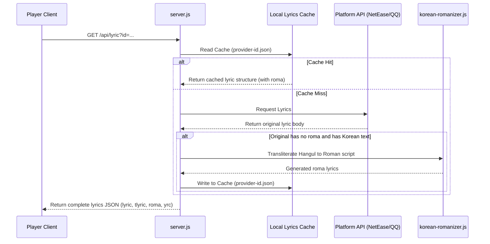

# Korean Lyric Romanization Design Spec

This document details the design and implementation plan for adding automatic Korean Hangul lyric romanization (transliteration) and local caching inside the Mineradio backend (`server.js`).

## Background & Objectives

Currently, Mineradio supports rendering lyrics, translations (`tlyric`), and romaji/romanization (`roma`) on the 3D stage lyric display. However, many Korean songs on NetEase Music or QQ Music do not natively provide a `roma` track. This prevents users from reading the phonetics for singing along.

The goal is to implement a **lightweight, dependency-free Korean romanization engine** in the Node.js backend. When lyrics are loaded, if no romanization is provided by the music platform and Korean characters are present, the backend will auto-transliterate the Hangul text into Roman script (adhering to basic pronunciation assimilation rules) and save it to a local cache.

---

## Proposed System Architecture



---

## Technical Specifications

### 1. Trigger Strategy & API Interception
We will intercept the logic inside `server.js`:
* Route `/api/lyric` (NetEase Music)
* Route `/api/qq/lyric` (QQ Music)

When the response payload from the external API is parsed:
1. Verify if `roma` text is empty or absent.
2. If empty, check if the main `lyric` contains Korean Hangul characters using the regular expression `[\uAC00-\uD7A3]`.
3. If matches, extract lines, ignore LRC timestamps, apply the transliteration algorithm to the line content, and re-attach timestamps.

### 2. Dependency-Free Korean Romanization Algorithm
We will create a module [korean-romanizer.js](file:///home/user/workplace/AI/codex/Mineradio/korean-romanizer.js).

Hangul syllables are decomposed based on Unicode index:
$$\text{SIndex} = \text{CharCode} - 0\text{xAC00}$$
$$\text{ChoseongIndex} = \lfloor\text{SIndex} / 588\rfloor$$
$$\text{JungseongIndex} = \lfloor(\text{SIndex} \bmod 588) / 28\rfloor$$
$$\text{JongseongIndex} = \text{SIndex} \bmod 28$$

#### Phonetic Mapping Tables
* **Choseong (Initial, 19 consonants)**:
  `['g', 'kk', 'n', 'd', 'tt', 'r', 'm', 'b', 'pp', 's', 'ss', '', 'j', 'jj', 'ch', 'k', 't', 'p', 'h']` *(Note: Initial 'ㅇ' is empty/silent)*
* **Jungseong (Nucleus, 21 vowels)**:
  `['a', 'ae', 'ya', 'yae', 'eo', 'e', 'yeo', 'ye', 'o', 'wa', 'wae', 'oe', 'yo', 'u', 'wo', 'we', 'wi', 'yu', 'eu', 'ui', 'i']`
* **Jongseong (Coda, 28 consonants, index 0 is empty)**:
  `['', 'k', 'k', 'k', 'n', 'n', 'n', 't', 'l', 'k', 'm', 'l', 'l', 'l', 'l', 'l', 'm', 'p', 'p', 't', 't', 'ng', 't', 't', 'k', 't', 'p', 't']`

#### Pronunciation Assimilation Rules (State Machine)
To guarantee high-quality pronunciation, the algorithm scans Hangul syllables dynamically:
1. **Liaison (연음)**: If a syllable has a coda (Jongseong) and the subsequent syllable begins with a silent initial (Choseong `ㅇ`), the coda moves to the initial position of the next syllable.
   * *Example*: `한국어 (han-gug-eo)` → pronounced as `한구거` → Romanized as `han-gu-geo`.
2. **Nasalization (비음화)**: If coda `ㄱ/ㄷ/ㅂ` is followed by initial `ㄴ/ㅁ`, they assimilate into `ng/n/m`.
   * *Example*: `합니다 (hab-ni-da)` → pronounced as `함니다` → Romanized as `ham-ni-da`.
3. **Lateralization (유음화)**: If `ㄴ` meets `ㄹ`, or `ㄹ` meets `ㄴ`, both sound like double lateral `ll`.
   * *Example*: `신라 (sin-la)` → pronounced as `실라` → Romanized as `sil-la`.

### 3. Caching Strategy
* **Storage Location**:
  * Windows: `D:\MineradioCache\lyrics` (Fallback to `~/.cache/Mineradio/lyrics` if D:\ is missing or unwritable)
  * Linux: `~/.cache/Mineradio/lyrics`
* **File Format**: `[provider]-[songId].json` containing:
  ```json
  {
    "songId": "409872",
    "provider": "netease",
    "roma": "[00:12.30]an-nyeong-ha-se-yo\n...",
    "savedAt": 1720183200000
  }
  ```

---

## Verification Plan

### Automated Tests
* Create a dedicated unit test suite `test/korean-romanizer.test.js`.
* Test standard cases and pronunciation assimilation cases (e.g. `한국어`, `합니다`, `신라`).

### Manual Verification
1. Run `node --check server.js` to verify syntax.
2. Launch Mineradio and play a Korean song that lacks native romanization (e.g. standard K-Pop tracks).
3. Open the DIY Visual Panel to verify that Romanization is automatically rendered and correctly aligned with the Korean lyrics.
4. Verify that the cache directory contains the newly generated `.json` files.
